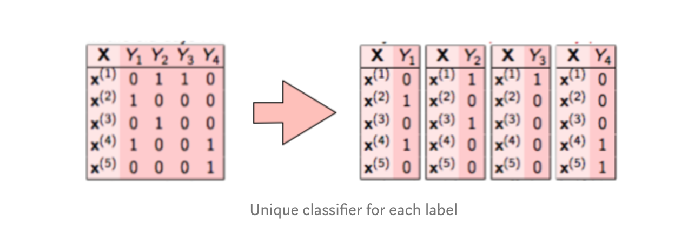
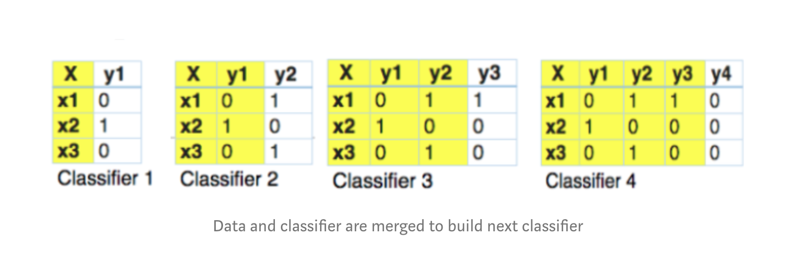
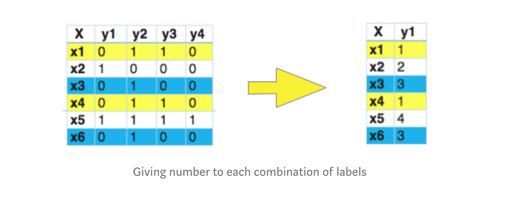

# Toxic-Comment-Classification
## A multi-label classification problem to promote good online conversations

**The Major Libraries which have to be installed for running this project are :** 

scikit-learn \
scipy \
numpy \
pandas \
scikit-multilearn \
stop_words \
matplotlib \
nltk 

**Method for multi-label:**
* Binary Relevance

This method does not take into account the interdependence of labels. Each label is solved separately like a single label classification problem. This is the simplest approach to be applied
 

* Classifier Chains

In this method, the first classifier is trained on input data and then each next classifier is trained on the input space and previous classifier, and so on. Hence this method takes into account some interdependence between labels and input data. 

* Label Powerset

In this method, we consider all unique combinations of labels possible. Any one particular combination hence serves as a label, converting our multi-label problem to a multi class classification problem. Considering our dataset, many comments are such that they have all non-toxic labels together and many are such that obscene and insult are true together. Hence, this algorithm seems to be a good method to be applied.

**Metrics for unbalanced dataset:** 
An important observation was the fact that our data was skewed, i.e. very less percentage of total comments were actually toxic(less than 10%). Therefore, choosing accuracy as metric would give invalid results. For example even if we construct a basic classifier which predicts everything to be non-toxic, it would be able to do so with 90% accuracy. It would not be able to find what is actually wanted but still give good metric scores \

Log loss \
Hamming Loss\
F1 score \
Confusion Matrix

**Result:** 
We choose to compare Multinomial Naive Bayes , Logistic Regression and Linear Support Vector Machine. The best result is from Linear Support Vector Machine.
